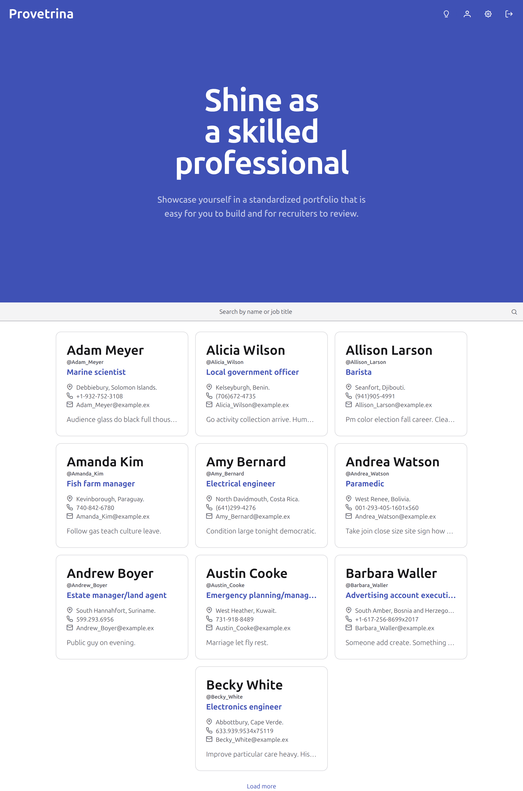
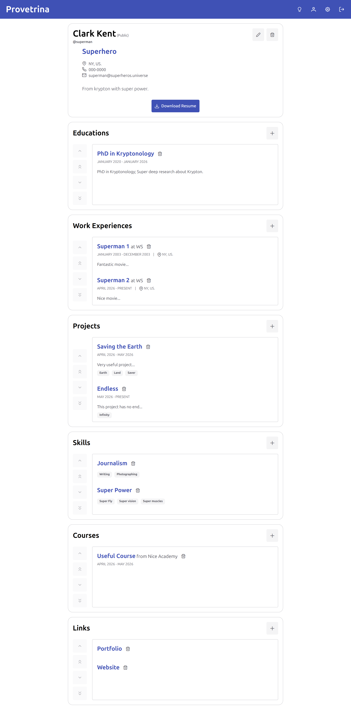
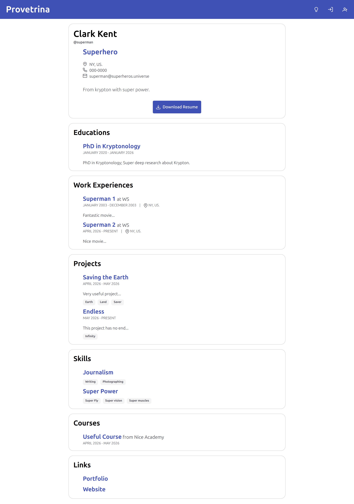

# [Provetrina](https://provetrina.pages.dev)

Shine as a skilled professional by showcasing yourself in a standardized portfolio that is easy for you to build and for recruiters to review.

**Provetrina** is a professional talent directory and portfolio builder designed to bridge the gap between talented individuals and potential opportunities. It allows users to create, manage, and share comprehensive professional profiles.

> **Note**: This repository contains the front-end, Angular app that utilizes a separate [Django Backend](https://github.com/hussein-m-kandil/django-backend).

## Demo

[A demonstration video.](https://youtu.be/Ru4h8IAYGew)

## Screenshots

## Features

Provetrina is built as a modern, decoupled Single Page Application (SPA) with advanced features and comprehensive testing suite.

The project separates the **Django REST Framework (DRF)** backend from an **Angular** frontend. This separation required implementing complex **cross-origin resource sharing** (CORS), **token-based authentication**, and a robust API design.

- **Dynamic PDF Generation**: Dynamically **generates professional PDF resumes** based on the user's latest data.
- **Modular Component Architecture**: This app is organized by feature, utilizing **Angular’s signals**, standalone components, and **sophisticated state management**.
- **Advanced Data Operations**: Users can **reorder**, **add**, and **delete** entries within multiple profile sections (Education, Work, Projects, etc.).
- **Privacy Controls**: Users can toggle their profile between **public and private**. This affects searchability in the talent directory and governs **access permissions** for viewing profiles and downloading resumes.
- **Talent Directory**: A home page that displays a simple hero and **searchable profile list** to facilitate profiles discovery.
- **Automated Testing**: The project includes a full testing suite using **Vitest** and the **Angular Testing Library**.

---

## How to Run the Application

### Prerequisites

- **[Django Backend](https://github.com/hussein-m-kandil/django-backend) server running locally**
- **Node.js** 22
- **NPM** 11
- **Angular** 21

### Setup

1. Install dependencies: `npm install`.
2. Start the dev server: `npm start`.
3. Open your browser to `http://localhost:4200`.

### Testing

Run the tests with `npm test`.

---

## Additional Information

- **User Flow**: Authenticated users start with an account page; upon visiting their profile page for the first time, they are prompted to create a profile. Once created, they can manage multiple entries across five distinct professional sections.
- **Mobile Responsiveness**: The UI is designed to be fully responsive across all device sizes.
